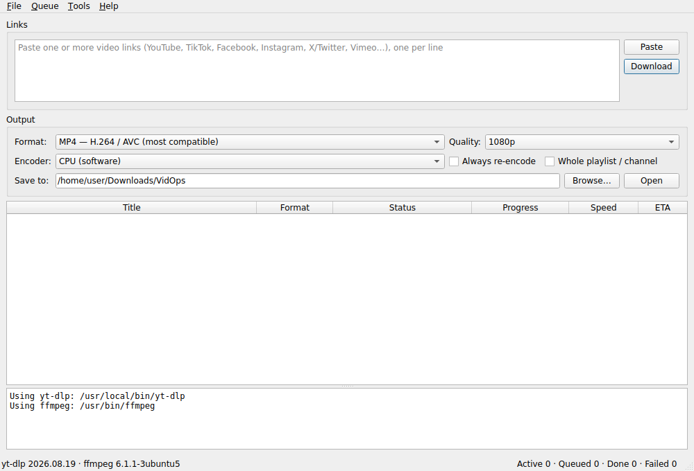

# VidOps

VidOps is a cross-platform desktop video downloader for YouTube, TikTok, and more.

A Qt 6 / C++17 desktop app that downloads videos from YouTube, TikTok, Facebook,
Instagram, X/Twitter, Vimeo and [1000+ other sites](https://github.com/yt-dlp/yt-dlp/blob/master/supportedsites.md)
and saves them as **standard MP4** files: H.264, H.265 or AV1 video with AAC audio.

Under the hood it drives [yt-dlp](https://github.com/yt-dlp/yt-dlp) (site support)
and [FFmpeg](https://ffmpeg.org) (merging and conversion). The release packages
bundle both, so nothing else needs to be installed.



## Tiếng Việt — hướng dẫn nhanh

1. Tải bản build cho máy của bạn ở mục **Actions → Build → Artifacts** (hoặc **Releases** khi có tag `v*`):
   - **Windows**: `VidOps-…-windows-x64.zip` → giải nén, chạy `VidOps.exe`.
   - **macOS**: `VidOps-…-macos-universal.dmg` → kéo VidOps vào Applications. Ứng dụng chưa được Apple
     notarize, lần đầu mở hãy chuột phải → **Open**, hoặc chạy `xattr -dr com.apple.quarantine /Applications/VidOps.app`.
   - **Ubuntu / Linux**: `VidOps-…-x86_64.AppImage` → `chmod +x VidOps-*.AppImage && ./VidOps-*.AppImage`.
2. Dán một hoặc nhiều link (mỗi dòng một link), chọn **Format** và **Quality**, rồi bấm **Download** (Ctrl+Enter).
3. Các định dạng:
   | Format | Kết quả |
   |---|---|
   | MP4 — H.264 / AVC | Tương thích nhất (TV, điện thoại, trình chỉnh sửa video) |
   | MP4 — H.265 / HEVC | File nhỏ hơn ~40%, giữ 10-bit/HDR khi encode bằng CPU |
   | MP4 — AV1 | File nhỏ nhất, cần thiết bị mới |
   | MP4 — giữ codec gốc | Không encode lại, nhanh nhất |
   | Audio — M4A / MP3 | Chỉ lấy âm thanh |

   Nếu nguồn đã đúng codec, VidOps chỉ copy stream (không giảm chất lượng). Nếu không, video được encode lại bằng
   CPU hoặc GPU (NVENC / Quick Sync / AMF / VideoToolbox); nếu GPU lỗi sẽ tự chuyển sang CPU.
4. Video riêng tư / giới hạn tuổi / cần đăng nhập: vào **File → Settings → Cookies from browser** và chọn trình duyệt đã đăng nhập.
5. Khi một trang ngừng tải được, chọn **Tools → Update yt-dlp**.

> Chỉ tải nội dung bạn sở hữu hoặc được phép tải, và tuân thủ điều khoản của từng nền tảng.

## Features

- Paste many links at once (or drag & drop), with a download queue, parallel downloads, cancel and retry
- Output: MP4 H.264 / H.265 (HEVC, tagged `hvc1` for Apple players) / AV1, the source codec, or audio-only M4A / MP3
- Max resolution: best, 2160p, 1440p, 1080p, 720p, 480p, 360p
- Smart conversion: picks the stream closest to the requested codec, then
  - copies streams that already match (no quality loss),
  - converts only the audio when only the audio is wrong (e.g. Opus → AAC),
  - re-encodes the video otherwise, with CRF / speed presets
- Hardware encoders (NVIDIA NVENC, Intel Quick Sync, AMD AMF, Apple VideoToolbox), with automatic fallback to the CPU
- Playlists / channels, browser cookies or `cookies.txt`, custom yt-dlp file name templates
- Per-item progress, speed and ETA, plus a full log; built-in yt-dlp updater

## How it works

```
URL ──► yt-dlp (-S res:1080,vcodec:h264,acodec:aac, merge → .mp4)
            │
            ▼
        ffprobe ──► already H.264 + AAC? ──yes──► done
            │no
            ▼
        ffmpeg (copy what matches, re-encode the rest, +faststart) ──► .mp4
```

| Directory | Contents |
|---|---|
| `src/core` | Qt Core only: yt-dlp argument building and output parsing, ffprobe parsing and conversion planning, process handling, download queue, settings |
| `src/ui` | Qt Widgets: main window, settings dialog, progress delegate |
| `tests` | Qt Test unit tests for the core |
| `scripts` | Fetch the bundled tools; package the AppImage and DMG |

VidOps looks for `yt-dlp`, `ffmpeg` and `ffprobe` next to its executable, in a `tools/` folder next to it,
then on `PATH` (and in Homebrew / `~/.local/bin` on macOS and Linux). Any of them can be overridden in **Settings**.

## Building from source

Requirements: CMake ≥ 3.19, a C++17 compiler and Qt ≥ 6.2 (Core, Gui, Widgets; Test for the unit tests).
At runtime: yt-dlp, ffmpeg and ffprobe.

```bash
# Ubuntu 24.04
sudo apt install build-essential cmake qt6-base-dev ffmpeg
pipx install yt-dlp            # or: scripts/fetch-tools.sh build/tools

cmake -S . -B build -DCMAKE_BUILD_TYPE=Release
cmake --build build --parallel
ctest --test-dir build --output-on-failure
./build/VidOps
```

```bash
# macOS (Homebrew)
brew install cmake qt ffmpeg yt-dlp
cmake -S . -B build -DCMAKE_BUILD_TYPE=Release -DCMAKE_PREFIX_PATH="$(brew --prefix qt)"
cmake --build build --parallel
open build/VidOps.app
```

```powershell
# Windows (Visual Studio 2022 + Qt 6 for MSVC 2022)
cmake -S . -B build -G "Visual Studio 17 2022" -A x64 -DCMAKE_PREFIX_PATH=C:\Qt\6.8.3\msvc2022_64
cmake --build build --config Release
C:\Qt\6.8.3\msvc2022_64\bin\windeployqt.exe build\Release\VidOps.exe
powershell -ExecutionPolicy Bypass -File scripts\fetch-tools.ps1 -Dest build\Release\tools
build\Release\VidOps.exe
```

## Packages and CI

`.github/workflows/build.yml` builds, tests and packages on every push and pull request:

| Platform | Runner | Package |
|---|---|---|
| Windows x64 | windows-2022, MSVC 2022 | `VidOps-<ver>-windows-x64.zip` (windeployqt + yt-dlp.exe + FFmpeg) |
| macOS 12+ (Apple Silicon + Intel) | macos-14, universal binary | `VidOps-<ver>-macos-universal.dmg` (macdeployqt, ad-hoc signed) |
| Linux x86_64 (glibc ≥ 2.35, e.g. Ubuntu 22.04+) | ubuntu-22.04 | `VidOps-<ver>-x86_64.AppImage` (linuxdeploy) |

Pushing a tag such as `v0.1.0` also publishes the three packages as a GitHub Release.
Bundled tools: yt-dlp from its GitHub releases, FFmpeg GPL builds from
[BtbN/FFmpeg-Builds](https://github.com/BtbN/FFmpeg-Builds) (Windows, Linux) and
[martin-riedl.de](https://ffmpeg.martin-riedl.de) (macOS).

## Legal

VidOps is licensed under the GNU GPL v3 (see `LICENSE`). It bundles yt-dlp (Unlicense) and GPL builds of FFmpeg.
Only download content you own or have permission to download, and respect each platform's terms of service.
